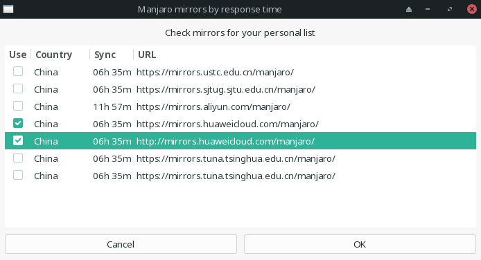
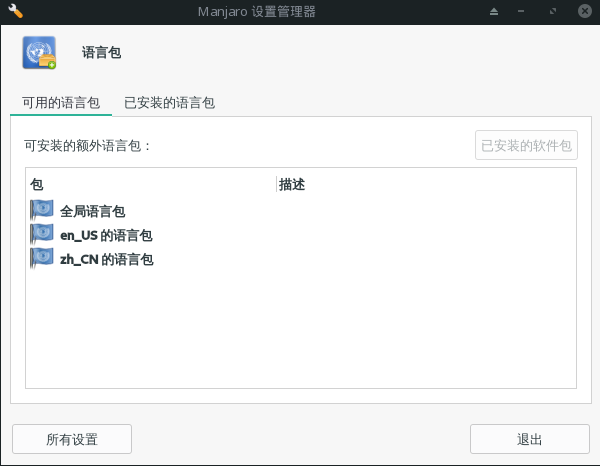

# manjaro安装后需要做的几件事

*桌面环境为xface*

1. 更换国内源，选择华为的源  
`sudo pacman-mirrors -i -c China -m rank`  
  
接着更新下缓存：  
`sudo pacman -Syy`  

2. 安装google拼音输入法，也可以安装搜狗输入法，只需要将fcitx-googlepinyin换成fcitx-sogoupinyin即可  
   `sudo pacman -S fcitx-im`  
   `sudo pacman -S fcitx-configtool`  
   `sudo pacman -S fcitx-googlepinyin`  
   然后需要修改配置文件 ~/.xprofile  
   `sudo vi ~/.xprofile`  
   复制下面这些内容，然后重启电脑  
   ```
   export GTK_IM_MODULE=fcitx
   export QT_IM_MODULE=fcitx
   export XMODIFIERS="@im=fcitx"
   ```
   
3. 安装语言包  
终端输入 `manjaro-settings-manager`，打开**manjaro设置管理器**  
点击 语言包->已安装的软件包 安装语言包


4. 安装idea  
   [IDEA官网](https://www.jetbrains.com/idea/download/#section=linux)  

5. 安装git，当前已默认安装  
   `sudo pacman -S git`  
   进行配置，首先生成密钥  
   `ssh-keygen -t rsa -C "你自己的邮箱地址"`  
   一路回车，这时候在家目录.ssh下会生成密钥对，将公钥id_rsa.hub中的内容全部拷贝到github上就好了  
   `vi ~/.ssh/id_rsa.pub`
   接着设置下自己的用户名和邮箱
   `git config --global user.name "用户名"`  
   `git config --global user.email "邮箱"`  

6. 安装maven  
   `sudo pacman -S maven`  
   修改配置文件  
   `sudo gedit /opt/maven/conf/settings.xml`  
   添加本来仓库目录  
   `<localRepository>/home/pony/workspace/mavenRepository/</localRepository>`  
   修改成阿里的源  
   ```
   <mirror>
	    <id>alimaven</id>
	    <mirrorOf>central</mirrorOf>
	    <name>aliyun maven</name>
	    <url>http://maven.aliyun.com/nexus/content/repositories/central/</url>
    </mirror>
    ```  
    IDEA默认会从`~/.m2/`下找配置文件，将配置文件copy到`~/.m2/`下  
    `cp /opt/maven/conf/settings.xml ~/.m2/settings.xml`
  
7. 安装flameshot截图软件  
   `sudo pacman -S flameshot`  
8. 安装网易云音乐  
   `sudo pacman -S netease-cloud-music`

9. 安装wonderwall壁纸软件  
   `sudo snap install wonderwall`  

10. 安装下载软件uget+aria2  
   `sudo pacman -S uget aria2`  

11. 安装笔记和阅读软件 cherrytree+calibre  
   `sudo pacman -S cherrytree calibre`