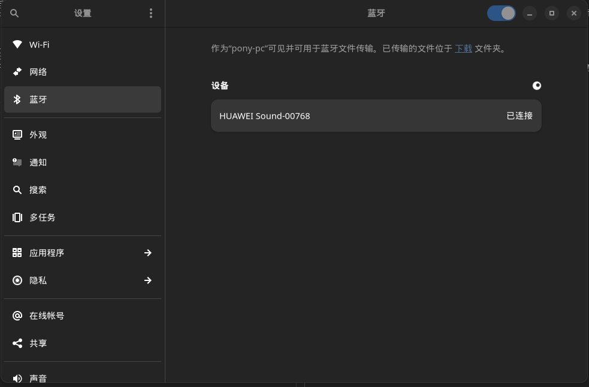

## 背景
我有一个蓝牙音响，当前每次开机之后，需要手动点击一下连接蓝牙音响，每次都手动连接，其实挺烦的，这时候需要有一个能力，当每次开机之后自动连接蓝牙。

## 解决办法
参考帖子[Desktop entries](https://wiki.archlinux.org/title/Desktop_entries_(%E7%AE%80%E4%BD%93%E4%B8%AD%E6%96%87))可以通过配置.desktop文件实现在桌面启动时执行启动命令。  

## 步骤
### 1. 连接蓝牙音响
连接后如下图所示

点开蓝牙，可以看到mac地址为：`78:85:F4:EC:AE:45`


### 2. 执行命令验证是否能成功连接蓝牙
```sh
bluetoothctl connect 78:85:F4:EC:AE:45
```

这时候不出意外蓝牙音响已经连上去了

### 3. 将连接蓝牙音响的命令配置在桌面启动时执行
在`~/.config/autostart`目录下创建bluetooth_auto_connect.desktop文件
```sh
touch ~/.config/autostart/bluetooth_auto_connect.desktop
```
打开bluetooth_auto_connect.desktop文件，
gedit ~/.config/autostart/bluetooth_auto_connect.desktop
输入如下内容
```
[Desktop Entry]
Path=/usr/bin
Exec=bluetoothctl connect 78:85:F4:EC:AE:45
Name=bluetooth_connect
Type=Application
Terminal=true
Hidden=false
```
如下图：

注意将Exec后的mac地址替换成自己实际的mac地址，然后重启，登陆，就可以看到蓝牙音响可以自动连接了。