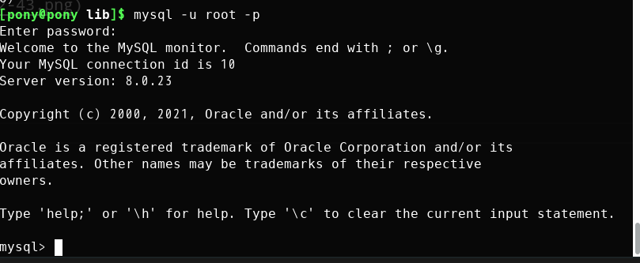

1. 安装mysql数据库  
   `sudo pacman -S mysql`  
2. 初始化数据库  
   `sudo mysqld --initialize --user=mysql --basedir=/usr --datadir=/var/lib/mysql`  
   如图为初始化密码  
     
3. 启动mysql服务  
   `sudo systemctl start mysqld`  
4. 连接mysql  
   `mysql -u root -p`
   输入2步骤中的密码  
     
5. 更改mysql密码  
   `alter user 'root'@'localhost' identified by 'mysql';`  
     
   退出后可用新密码登录  